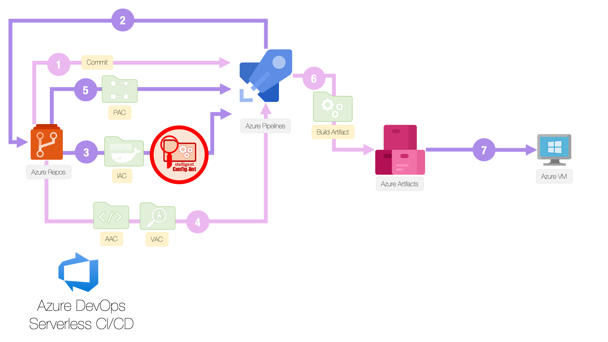

# Repository

## Purpose of the Repository
The purpose of this repository is to orchestrate a full CICD pipeline in azure. Native serverless azure devops services are used for CI. Deployment is on azure cloud resources.

  

## Desired state of the Repository

  

## Other Related Initiatives

  

## How to run the Repository

### Before you begin

* Create an organization in azure devops
* Create a project in azure devops
* Create an active directory (tenant ID) in azure portal
* Create a subscription in azure portal (and link it to your tenant ID)
* Connect the devops organization with the tenant ID
* Connect the azure devops project to the subscription using a service connection
